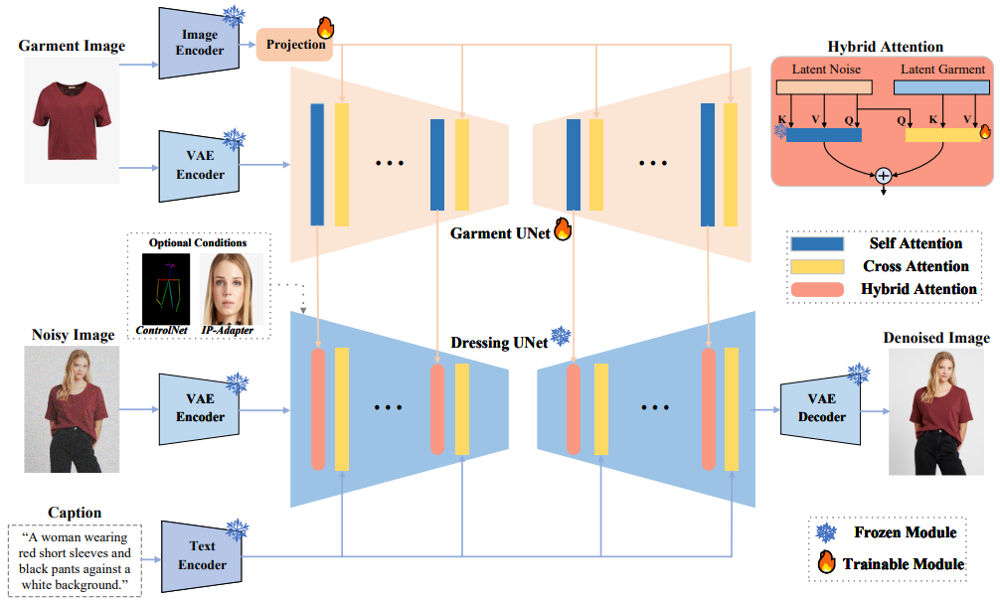

# diffusers_tryon_from_scratch
diffusers版本实现的Virtual Try-on, 用于学习目的, 帮助更好的了解它的工作原理。

# 🏷️  Introduction



## 🔧 Requirements

```bash
conda create -n tryon python=3.8.10
conda activate tryon
pip install -U pip
pip install torch==2.0.1 torchvision==0.15.2 torchaudio==2.0.2
pip install -r requirements.txt
```

## 🐳 Conclusion

基于SD1.5 + Reference-Unet完成的虚拟换装。大概流程是: 

第一步, 复制一份和sd1.5-unet相同结构的unet作为reference-unet, 利用unet的set_attn_processor方法替换掉reference-unet和denoising-unet中的注意力机制。参考Ip-adapter的做法, 使用ImageProjection方法获取Garment Features, 并将特征放入reference-unet中的注意力机制中, 并存储hidden states。

第二步, 将模型图放入denosing-unet, 获取reference-unet传递的garment-features, 完成商品信息与模特信息的融合。

第三步, 训练模型。训练的模块有: ImageProjection、reference-unet和denosing-unet的注意力模块。

## 📝 Citation
```bibtex
@article{shen2024IMAGDressing-v1,
  title={IMAGDressing-v1: Customizable Virtual Dressing},
  author={Shen, Fei and Jiang, Xin and He, Xin and Ye, Hu and Wang, Cong, and Du, Xiaoyu, Li Zechao, and Tang, Jinhui},
  booktitle={arXiv preprint arXiv:2407.12705},
  year={2024}
}
```
```bibtex
@article{chen2024magic,
  title={Magic Clothing: Controllable Garment-Driven Image Synthesis},
  author={Chen, Weifeng and Gu, Tao and Xu, Yuhao and Chen, Chengcai},
  journal={arXiv preprint arXiv:2404.09512},
  year={2024}
}
```
```bibtex
@article{xu2024ootdiffusion,
  title={OOTDiffusion: Outfitting Fusion based Latent Diffusion for Controllable Virtual Try-on},
  author={Xu, Yuhao and Gu, Tao and Chen, Weifeng and Chen, Chengcai},
  journal={arXiv preprint arXiv:2403.01779},
  year={2024}
}
```